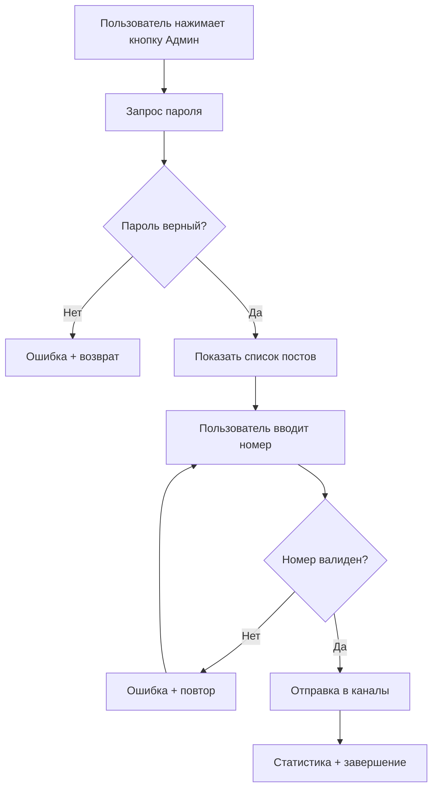

# 🔐 Админ-функция: Ручная отправка постов

## 📋 Обзор

Реализована защищенная паролем функция для ручной отправки постов в каналы вне обычного расписания. Администратор может выбрать любой пост из базы и немедленно отправить его во все настроенные каналы.

## ✨ Возможности

- 🔒 **Защита паролем** - доступ только с паролем администратора
- 📝 **Список всех постов** - удобный выбор из пронумерованного списка
- 🚀 **Мгновенная отправка** - пост отправляется во все каналы немедленно
- 📊 **Статистика отправки** - подробный отчет о результатах
- 🕐 **Таймаут безопасности** - автоматическое завершение через 5 минут
- 📝 **Логирование** - все действия записываются с меткой [АДМИН]

## 🏗️ Архитектура

### Компоненты

1. **config.py**
   - Загрузка `ADMIN_PASSWORD` из .env файла
   - Предупреждение при отсутствии пароля

2. **handlers.py**
   - Константы состояний: `ADMIN_PASSWORD_STATE`, `ADMIN_POST_SELECTION_STATE`
   - Функции:
     - `admin_send_post_button()` - обработка кнопки
     - `admin_check_password()` - проверка пароля
     - `admin_select_post()` - выбор и отправка поста
     - `admin_cancel()` - отмена операции
   - `admin_conversation_handler` - управление диалогом

3. **bot.py**
   - Метод `send_specific_message()` - отправка конкретного поста
   - Регистрация `admin_conversation_handler`
   - Сохранение `bot_instance` в `bot_data`

4. **.env.example**
   - Документация переменной `ADMIN_PASSWORD`
   - Рекомендации по безопасности

5. **README.md**
   - Подробная документация функции
   - Примеры использования
   - Инструкции по настройке

## 🔄 Workflow



## 📝 Использование

### Шаг 1: Настройка пароля

Добавьте в файл `.env`:
```env
ADMIN_PASSWORD=MySecureP@ssw0rd2026!
```

Или в Railway (Settings → Variables):
```
ADMIN_PASSWORD = ваш_надежный_пароль
```

### Шаг 2: Использование в Telegram

1. Откройте бота и введите `/start`
2. Нажмите кнопку **"📤 Отправить пост (Админ)"**
3. Введите пароль администратора
4. Выберите пост из списка (введите номер)
5. Пост будет отправлен во все каналы

### Шаг 3: Отмена операции

В любой момент используйте команду `/cancel`

## 🔒 Безопасность

### Реализованные меры

- ✅ Пароль хранится только в переменных окружения
- ✅ `.env` файл исключен из git через `.gitignore`
- ✅ Неудачные попытки входа логируются
- ✅ Таймаут диалога: 5 минут
- ✅ Все админ-отправки помечены префиксом `[АДМИН]`
- ✅ Кнопка видна всем, но функция защищена паролем

### Рекомендации

1. **Используйте сложный пароль**
   - Минимум 12 символов
   - Комбинация букв, цифр и символов
   - Пример: `MySecureP@ssw0rd2026!`

2. **Не делитесь паролем**
   - Только для доверенных администраторов
   - Регулярно меняйте пароль

3. **Мониторинг**
   - Проверяйте логи на подозрительную активность
   - Все попытки входа записываются

## 📊 Логирование

### Формат логов

```
[АДМИН] Запрос админ-панели от пользователя 12345 (@username)
[АДМИН] Неверный пароль от пользователя 12345 (@username)
[АДМИН] Успешная авторизация пользователя 12345 (@username)
[АДМИН] Пользователь 12345 выбрал пост #5: Название поста
[АДМИН] Отправка сообщения 5 (Название поста)
[АДМИН] Отправка в канал -1001234567890...
[АДМИН] Отправка завершена: успешно 2, ошибок 0
```

### База данных

Все отправки записываются в таблицу `message_history` с префиксом `[АДМИН]` в названии:
- `message_id` - ID сообщения
- `message_title` - `[АДМИН] Название поста`
- `channel_id` - ID канала
- `sent_at` - Время отправки
- `success` - Статус отправки

## 🧪 Тестирование

### Автоматические тесты

Запустите тестовый скрипт:
```bash
python test_admin_function.py
```

Проверяются:
- ✅ Загрузка ADMIN_PASSWORD
- ✅ Импорты в handlers.py
- ✅ Метод send_specific_message
- ✅ Загрузка сообщений
- ✅ ConversationHandler
- ✅ Интеграция с ботом
- ✅ .env.example
- ✅ README.md

### Ручное тестирование

1. **Проверка кнопки**
   - Откройте бота
   - Убедитесь, что кнопка "📤 Отправить пост (Админ)" видна

2. **Проверка пароля**
   - Нажмите кнопку
   - Введите неверный пароль → должна быть ошибка
   - Введите верный пароль → должен показаться список

3. **Проверка выбора**
   - Введите несуществующий номер → ошибка
   - Введите корректный номер → отправка

4. **Проверка отмены**
   - Нажмите кнопку
   - Используйте `/cancel` → операция отменена

5. **Проверка таймаута**
   - Нажмите кнопку
   - Ждите 5 минут без действий → таймаут

## 📈 Статистика отправки

После отправки поста показывается подробный отчет:

```
✅ Пост успешно отправлен во все каналы!

📝 Пост: Название выбранного поста
📊 Статистика:
  • Успешно: 2/2
  • Ошибок: 0/2
```

Возможные статусы:
- ✅ **Успешно** - отправлено во все каналы
- ⚠️ **Частично** - отправлено в некоторые каналы
- ❌ **Ошибка** - не отправлено ни в один канал

## 🔧 Техническая информация

### Состояния ConversationHandler

```python
ADMIN_PASSWORD_STATE = 1      # Ожидание ввода пароля
ADMIN_POST_SELECTION_STATE = 2  # Ожидание выбора поста
```

### Таймаут

```python
conversation_timeout = 300  # 5 минут
```

### Entry Points

- `CallbackQueryHandler` с pattern `"^admin_send_post$"`

### Fallbacks

- `CommandHandler("cancel", admin_cancel)`

### Сигнатура метода

```python
async def send_specific_message(self, message: Dict) -> Dict:
    """
    Args:
        message: Словарь с данными сообщения
        
    Returns:
        {
            'success_count': int,
            'error_count': int,
            'channels': [{'channel_id': int, 'success': bool}, ...]
        }
    """
```

## 🚀 Деплой

### Railway

1. Добавьте переменную окружения в Settings → Variables:
   ```
   ADMIN_PASSWORD = ваш_надежный_пароль
   ```

2. Railway автоматически передеплоит бота

### Локально

1. Добавьте в `.env`:
   ```env
   ADMIN_PASSWORD=ваш_надежный_пароль
   ```

2. Перезапустите бота:
   ```bash
   python bot.py
   ```

## ❓ FAQ

### Q: Что делать, если забыл пароль?

A: Измените `ADMIN_PASSWORD` в `.env` файле (локально) или в переменных окружения (Railway), затем перезапустите бота.

### Q: Можно ли дать доступ нескольким людям?

A: Да, просто поделитесь одним паролем. Все действия будут логироваться с user_id и username.

### Q: Можно ли отправить в конкретный канал?

A: В текущей версии пост отправляется во все настроенные каналы. Эта функция может быть добавлена в будущем.

### Q: Как отменить отправку?

A: После выбора поста отправка происходит мгновенно. Используйте `/cancel` ДО выбора поста.

### Q: Можно ли увидеть превью поста?

A: В текущей версии нет. Эта функция может быть добавлена в будущем.

## 📝 История изменений

**Версия 1.0** (2026-01-22)
- ✅ Первая реализация админ-функции
- ✅ Защита паролем
- ✅ Выбор из списка постов
- ✅ Отправка во все каналы
- ✅ Логирование всех действий
- ✅ Полная документация

## 🎯 Будущие улучшения

Возможные дополнения (опционально):
- [ ] Выбор конкретных каналов для отправки
- [ ] Предпросмотр поста перед отправкой
- [ ] История админ-отправок в отдельной таблице
- [ ] Разные уровни доступа (admin, moderator)
- [ ] Планирование отложенной отправки

---

**Статус:** ✅ Реализовано и протестировано  
**Версия:** 1.0  
**Дата:** 22.01.2026
